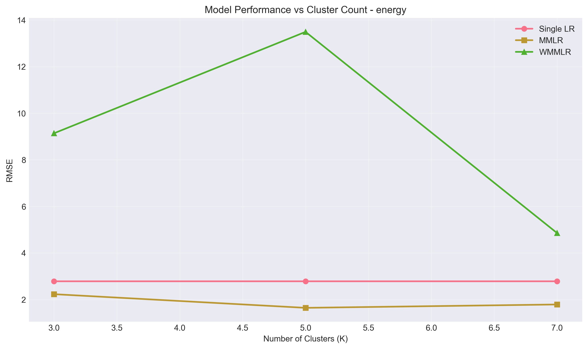

# MMLR / WMMLR From Scratch

NumPy implementation of Multi-Model Linear Regression (MMLR) and Weighted MMLR (WMMLR), based on Lyu & Li (2023, [arXiv:2308.12691](https://arxiv.org/abs/2308.12691)). Both methods partition the input space with k-means and fit a local ridge regressor per cluster; WMMLR adds a soft-expert weighting on top. Models are benchmarked against a single global ridge regressor on three UCI datasets:

- Energy Efficiency (`768` rows, `8` features)
- Bike Sharing (`17,379` rows, `12` features after leakage columns are removed)
- Air Quality (`9,357` rows, `12` features)

## Key Results

In the latest saved run, MMLR improved RMSE over a single global ridge regressor on all three datasets. WMMLR was less reliable in this configuration: it beat Single LR on Bike for some `k` values, but underperformed MMLR across all datasets.

| Dataset | Single LR | Best MMLR | RMSE Change vs Single LR | Best WMMLR |
|---|---:|---:|---:|---:|
| Energy | 2.7894 | 1.6475 (k=5) | -40.9% | 4.8584 (k=7) |
| Bike | 140.6294 | 132.2745 (k=7) | -5.9% | 136.3697 (k=7) |
| AirQuality | 0.5711 | 0.5540 (k=7) | -3.0% | 0.6939 (k=7) |



## Findings

- **Clustered local regression helps most when the response is piecewise linear.** The largest gain (~41%) is on Energy Efficiency, where heating/cooling load depends on building geometry in piecewise ways that a single global model averages over.
- **Gains shrink on already-linear-ish problems.** Bike Sharing and Air Quality leave only a few percent of headroom for MMLR over a single ridge regressor.
- **WMMLR's weighting needs more calibration.** Reliability scores derived from validation MSE per cluster become noisy on small validation slices and pull predictions toward weak local models. See [Future Work](#future-work).

## Project Structure

- `main.py` — full experiment runner (load → split → train → evaluate → plot)
- `models/` — `linear_regression`, `kmeans`, `mmlr_model`, `wmmlr_model`
- `utils/` — data loading, preprocessing, metrics, visualizations
- `tests/` — pytest unit tests for each component
- `data/` — three UCI datasets (`ENB2012_data.csv`, `hour.csv`, `AirQualityUCI.csv`)
- `assets/` — plots embedded in this README

## Tech

Python 3.10+, NumPy, pandas, scikit-learn (only `StandardScaler` and `PCA`), Matplotlib, seaborn, pytest. Dependencies are listed in `requirements.txt`.

## Getting Started

```powershell
git clone https://github.com/asadabdullahaa1/multi-model-regression-from-scratch.git
cd multi-model-regression-from-scratch

python -m venv .venv
.\.venv\Scripts\Activate.ps1

python -m pip install --upgrade pip
python -m pip install -r requirements.txt
```

Run the full experiment:

```powershell
python main.py
```

Each run writes a timestamped `results_run_YYYY-MM-DD_HH-MM-SS/` directory with per-dataset CSV summaries and comparison plots (clusters, weights, predictions vs actual, RMSE comparisons, performance vs k).

## Running Tests

```powershell
pytest
```

The suite covers data loading invariants, split reproducibility, ridge closed-form correctness on synthetic linear data, k-means cluster recovery, and shape/finiteness checks on MMLR and WMMLR outputs.

## Using the Models on Your Own Data

```python
from models.mmlr_model import MMLR
from models.wmmlr_model import WMMLR

mmlr = MMLR(k=5, lambda_reg=0.01, random_state=42)
mmlr.fit(X_train, y_train)
y_pred = mmlr.predict(X_test)

wmmlr = WMMLR(k=5, lambda_reg=0.01, random_state=42)
wmmlr.fit(X_train, y_train, X_val, y_val)
y_pred = wmmlr.predict(X_test)
```

## Reproducibility

All stochastic components (k-means initialization, train/val/test shuffles) accept `random_state` / `seed`. Defaults are pinned to `42` so a clean run reproduces the table above.

## Future Work

-  WMMLR weighting failure modes can be further invetigated by: validation-set size sensitivity, softmax temperature on reliability scores, and gating on cluster-membership probability instead of global reliability.
- Add cross-validated hyperparameter selection for `lambda_reg` and `k`.
- Extend benchmarks to higher-dimensional datasets to test how MMLR scales.

## Reference

Lyu, B., & Li, J. (2023). *An Efficient Data Analysis Method for Big Data Using Multiple-Model Linear Regression (MMLR)*. arXiv preprint [2308.12691](https://arxiv.org/abs/2308.12691).
